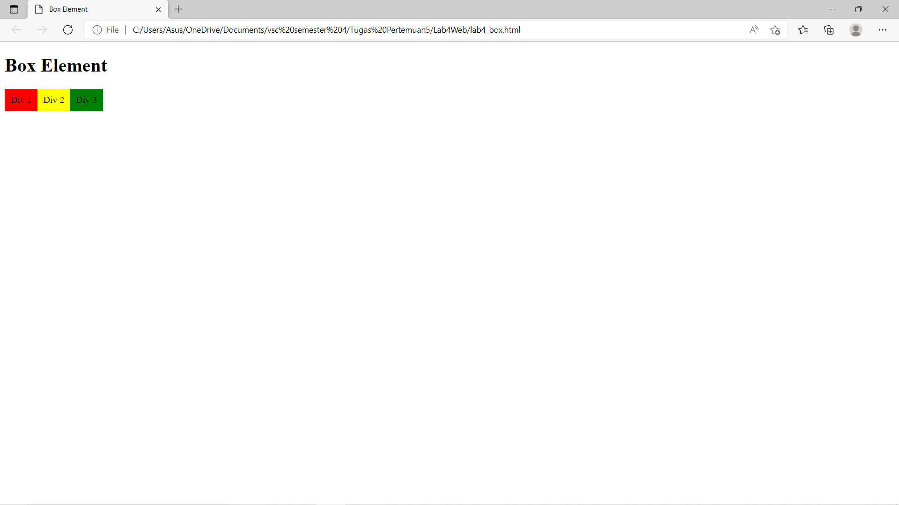
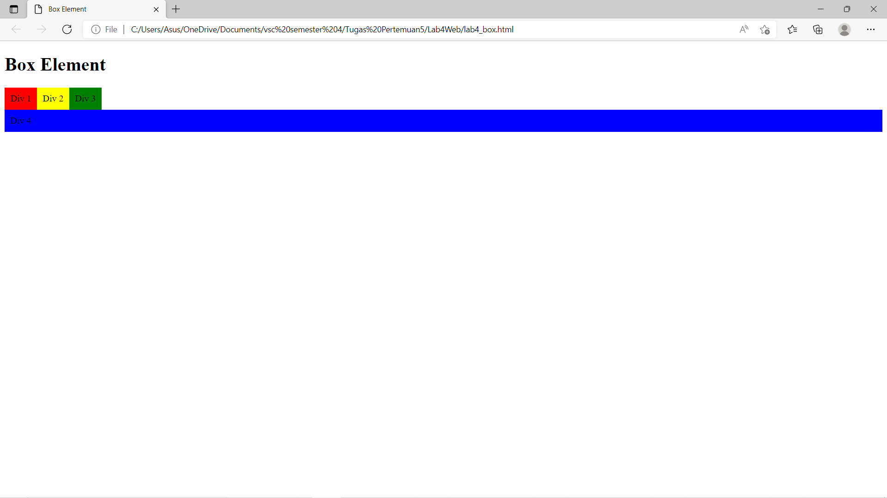

# Lab 4 Web
<hr>
Nama    : Maulana Muhamad <br>

NIM     : 312010188 <br>

Kelas   : TI.20. A.1 <br>
<hr>

## Langkah-langkah Praktikum
### 1.Persiapan membuat dokumen HTML dengan nama file lab4_box.html seperti berikut.

 
Gambar di atas adalah hasil codingan yang dibawah.

### Dibawah ini Adalah Codingan Dari Gambar Diatas:

```html
<!DOCTYPE html>
<html lang="en">
<head>
    <meta charset="UTF-8">
    <meta name="viewport" content="width=device-width, initial-scale=1.0">
    <title>Box Element</title>
</head>
<body>
    <header>
        <h1>Box Element</h1>
    </header>
</body>
</html>
```

```html
/* Membuat Box Element */
<section>
    <div class="div1">Div 1</div>
    <div class="div2">Div 2</div>
    <div class="div3">Div 3</div>
</section>
```

```html
/* CSS Float Property */
<style>
    div {
        float:left;
        padding: 10px;
    }
    .div1 {
        background: red;
    }
    .div2 {
        background: yellow;
    }
    .div3 {
        background: green;
    }
</style>
```

### 2.Membuat Ordered List
 
Gambar di atas adalah hasil codingan yang dibawah yang telah ditambahkan element tag div dan juga css clear yang kemudian float nya di none.

```html
<div class="div4">Div 4</div>
```

```html
<style>
.div4{
           background-color: blue;
           clear: left;
           float: none;
       }
</style>
```
